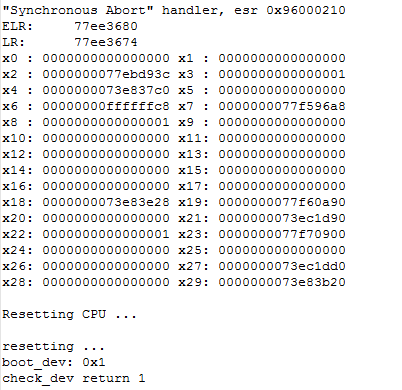
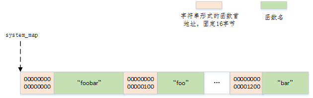
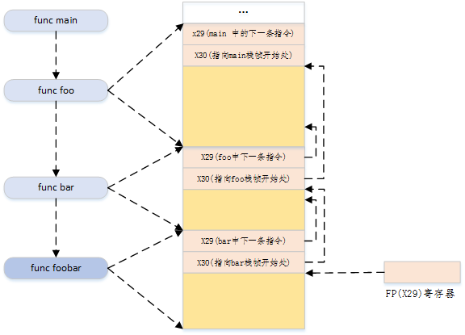

# 需求背景

<div align="center"></div>

<p align="center">P1. bootloader死机现场</p>

如图P1所示，bootloader下如果发生死机，可以获取的所有辅助信息仅仅是一些寄存器的内容。上面的ELR是发生死机时的PC值，我们需要通过addr2line工具获取死机时正在执行的代码，然后进一步分析。很明显得，我们可以感觉到这个分析过程非常不直观。

# 设计实现

为了使bootloader能够支持类似Linux下的堆栈打印，必须要实现以下两点

```
a. 符号查询
b. 栈回溯
```

符号查询指的是提供一个地址，可以返回该地址所在函数的函数名及偏移地址。

栈回溯指的是提供一个地址，可以获取到达该地址整个函数调用路径。

## 符号查询

原始的bootloader已经基本支持该功能，并可通过CONFIG_KALLSYMS宏来开关。

<div align="center"></div>

<p align="center">P2. bootloader函数符号组织方式</p>

如图P2所示，在打开CONFIG_KALLSYMS的情况下，会生成一个由地址和函数名对组成的巨大查询表。其中地址为字符串形式，固定16字节宽。同时bootloader中提供了函数symbol_lookup来查询(通过system_map)一个地址所在函数的函数名。

```
const char *symbol_lookup(unsigned long addr, unsigned long *caddr)
```

为了更好得服务于堆栈打印，这里将函数更新如下，这里caddr就是addr所在函数的首地址，naddr就是下一个函数的首地址，这样通过naddr和caddr就可以很容易得得知caddr函数的代码段长度了。

```
const char *symbol_lookup(unsigned long addr, unsigned long *caddr, unsigned long *naddr)
```

## 栈回溯

由于使用的平台期CPU是armv8架构的，且bootloader运行在aarch64模式，默认编译出的代码所使用的栈帧结构是符合arm calling style的(而armv8 aarch32模式下，使用arm gcc工具链编译出的代码，使用的是unwind形式的栈帧结构)

<div align="center"></div>

<p align="center">P3. ARMv8 AARCH64栈帧结构</p>

如图P3所示就是ARMv8 AARCH64模式下的栈帧结构，每次调用子函数(非inline的情况下)之前，就会由调用者负责创建将本函数中的下一条指令地址以及本函数的栈帧起始地址压入栈中，同时将当前的SP存入FP寄存器中。由此，很容易通过递归的方法定位到每一级调用中执行的指令地址。

完整的代码实现见srcs目录