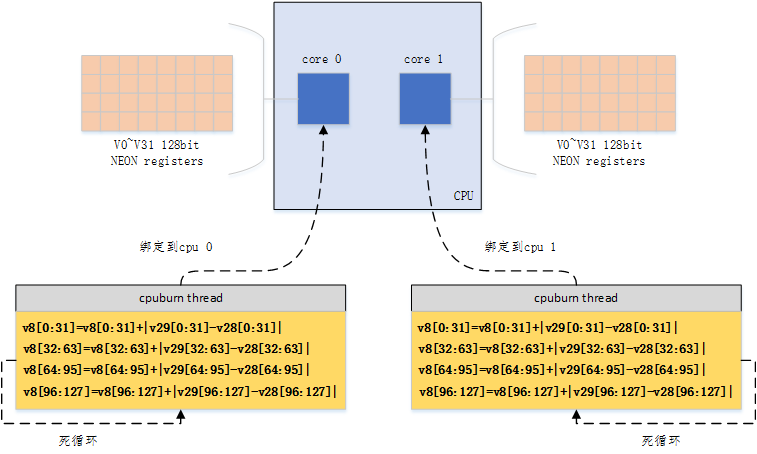
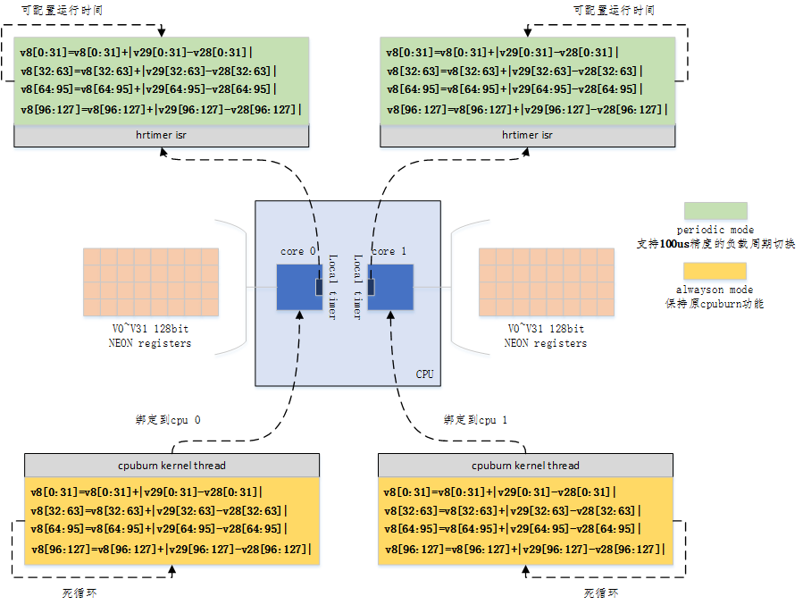
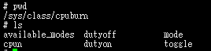
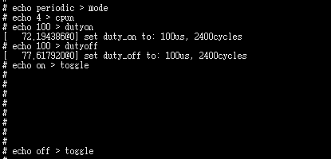
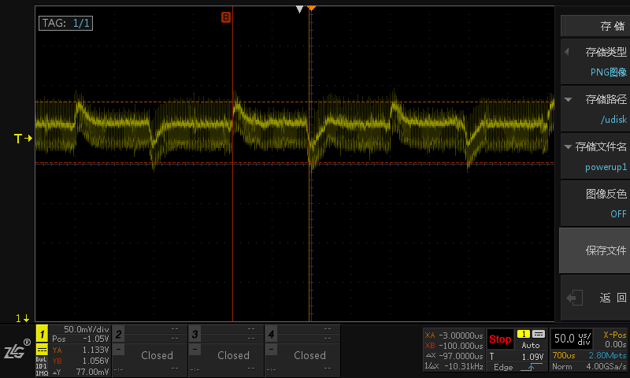

# 什么是cpuburn

cpuburn是一个可以让所有CPU核的使用率达到100%的压力测试工具。

P1 cpuburn overview

如上图所示，cpuburn会在每个核上运行一个线程，该线程以死循环的方式持续进行NEON寄存器的数学运算，来使CPU的负载达到100%。

# 当前CPUBURN存在的不足

原始的cpuburn只能以always on的方式运行，无法支持负载高低的快速可控切换。之所以有这样的需求，是因为SOC本身对电压过冲(overshoot)和电压跌落(dropshoot)有最大差值和持续时间的理论耐受范围。我们需要通过快速调整CPU负载，构造不同的电压过冲和电压跌落组合，来进行相应的压力测试。

# 对CPUBURN的改进

P2 cpuburn improve overview

如P2所示，这里将原始的CPUBURN移植到内核中运行，在保留原always on运行模式的基础上，利用高精度定时器hrtimer来支持最高达到100us精度的cpuburn负载空载切换。

# 使用改进后的CPUBURN

P3 cpuburn operations nodes

如P3所示，改进后的cpuburn以sys节点（/sys/class/cpuburn下）的方式提供给用户操作。每个操作节点的功能如表L1所示。

L1 cpuburn operations nodes description

| 节点            | 功能                                                |
| --------------- | --------------------------------------------------- |
| available_modes | 显示支持的工作模式，目前支持always on和periodic两种 |
| mode            | 设置当前的工作模式                                  |
| cpun            | 设置要对几个cpu进行cpuburn                          |
| dutyon          | 设置高负债的占空比，单位为us，最小支持值为100       |
| dutyoff         | 设置空载的占空比，单位为us，最小支持值为100         |
| toggle          | 开关cpuburn                                         |

在图P4 && P5中，我们给出了cpuburn以100us on && 100 off周期性运行时的结果

P4 cpuburn demon 100us on/off -- ops

P5 cpuburn demon 100us on/off -- voltage overshoot and dropshoot

