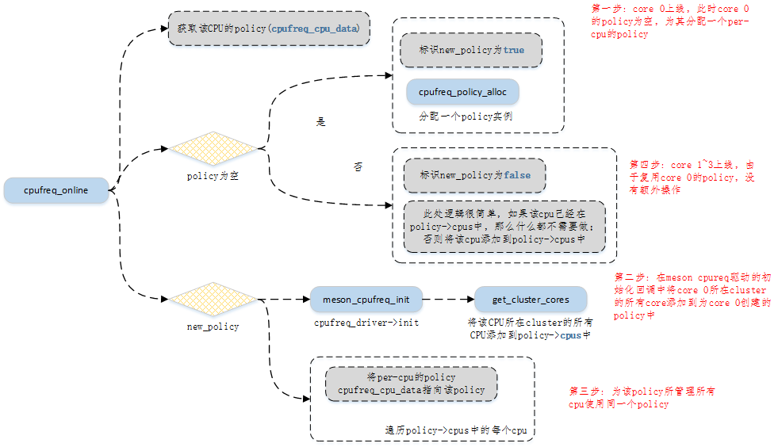

# 简介

2017年五月推出的Cortex-A75及Cortex-A55上实现了DynamIQ来替代原有的BIT.LITTLE。区别于后者，DynamIQ允许更为灵活的CPU核心配置，即每个cluster可支持最多8个CPU核心，各个CPU核心可以是不同的架构，且每个CPU核心由单独的时钟和电压控制。

<div align="center"></div>

<p align="center">P1. overview</p>

如图P1所示，在一个CPU cluster里集成了异构的A55和A75，分别作为小核和大核。这4个核用单独的clk提供频率，用单独的pwm提供电压。在这样的硬件条件下，就可以针对每个核进行调频调压操作了，也就是所谓的per-core DVFS。相较于per-cluster DVFS，其功耗管理更灵活，能最大限度得降低多核处理器的能耗。

当然，为了支持per-core DVFS，会使硬件系统的设计更加复杂也会带来更高的成本，这也是需要权衡的地方。

而本方案的目的在于基于现有的软硬环境，验证per-core DFVS的可行性。

由于仅仅是概念验证性质的，涉及到的代码实现在兼容性上就没有作过多考虑

# 实现思路

硬件上，选用了在一个cluster上集成了4颗A55核心的AMLOGIC SM1开发板

软件上，通过单独的clock tree驱动每个CPU核心；通过单独的PWM通路调节每个CPU核心的电压；在cpufreq层面，需要保证一个cpufreq policy管理一个CPU核心

## 单独的clock tree驱动每个CPU核心

<div align="center"></div>

<p align="center">P2. CPU 0 clock tree</p>

<div align="center"></div>

<p align="center">P3. CPU 1 clock tree</p>

如图P3所示，CPU 1的clk来源可以选择自己独立的时钟源(dedicated clock tree)，也可以选择和CPU 0共用时钟源(这种情况下就与之前A53的平台没有差别了)。CPU 2和CPU3的clock tree与CPU 1基本一致，只有寄存器地址有差异。为了使能per core的频率调节，这里需要为CPU 1~3 添加单独的的clock tree描述，并配置其parent为cts_cpu_1~3_clk_pre。

## 单独的PWM通路调节每个CPU核心电压

<div align="center"></div>

<p align="center">P4. CPU核供电</p>

如图P4所示，SM1 AC214在板级设计时，将各个CPU核心的电压输入端焊接在一起，并通过一路PWM电压供电，因此无法实现per core的电压调节。这里为了验证per-core dvfs的可行性，暂时CPU核心的电压固定到最高电压。

## 配置一个cpufreq policy管理一个CPU核心

<div align="center"></div>

<p align="center">P6. cpufreq policy初始化</p>

在governor层面，其实并不会关心是per-cluster的 DVFS还是per-core的DVFS，它能感知到的是cpufreq policy。如果policy下管理的是一个core，那么就可以实现per-core DVFS；如果policy下管理的是一个cluster，那么就是per-cluster DVFS。

而policy具体管理core还是cluster，是由平台相关的cpufreq驱动决定的，其流程如图P6所示。简单来说，每个CPU核心上电后会执行cpufreq_online函数，该函数最终会调用平台相关的cpufreq驱动的init回调，在该回调函数中指定每个policy可以管理的CPU核。

# 代码实现

基础的内核代码可以通过https://git.kernel.org/pub/scm/linux/kernel/git/khilman/linux-amlogic.git获取

然后依次打上patches目录下的补丁即可

具体各个补丁的说明见List 1

<p align="center">List 1. 补丁说明</p>

| 补丁名             | 修改说明                                                     |
| ------------------ | ------------------------------------------------------------ |
| 0001-add_xxx.patch | 为CPU1~3添加单独的clk tree描述，并将CPU1~3的parent设置为单独的clock tree |
| 0002-one_xxx.patch | 支持一个policy管理一个CPU核心                                |
| 0003-fix_xxx.patch | 将OPP中超过1GHZ的频率电压对删除(单独的clock tree只支持<=1GHZ的频率输出)，并将电压固定到最高 |

# 验证

这里将CPU 0和CPU 2的governor设置为schedutil，同时绑定一个重负载的任务到CPU0，并使CPU 2保持轻负载运行状态；将CPU 1和CPU 3的governor设置为performance，同时将CPU 1的最大可调频率设置为1GHZ，将CPU3的最大可调频率设置为667MHZ。

执行如下命令准备好测试环境

```
# cat /dev/zero > /dev/null &
# ./busybox taskset -p 1 408
# echo performance > /sys/devices/system/cpu/cpu1/cpufreq/scaling_governor
# echo performance > /sys/devices/system/cpu/cpu3/cpufreq/scaling_governor
# echo 666666 > /sys/devices/system/cpu/cpu3/cpufreq/scaling_max_freq
```

检查频率是否符合预期

<div align="center"></div>

<p align="center">P7. 验证结果</p>

运行结果如上图所示，可以看到CPU 0在重负载的情况下，当前频率被调整为最高频率，即1GHZ，CPU 2在轻负载的情况下，当前频率被调整为最低频率，即100MHZ；CPU 1和CPU 3在由于被performance governor管理，因此均运行在允许运行的最高频率下，分别是1GHZ和667MHZ。均符合预期。

