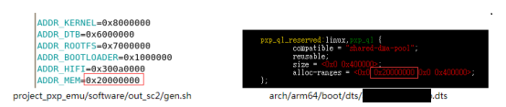

# Overview

Function verification on PXP/Z1 is very time consuming, which will waste more than 3 hours to reload bootloader and kernel. PXP_QUICK_LOAD mechanism can help shorten this process to minutes via skipping the bootloader and kernel reloading steps.

P1. overview of PXP_QUICK_LOAD mechanism

PXP_QUICK_LOAD consists of memory tool, a predefined memory area, pxp_quick_load kernel driver and pxp_quick_load tool. The memory tool comes from PXP/Z1, which can update data in memory when PXP/Z1 are paused. The predefined memory area carries tesing code in module format. pxp_quick_load driver/tool can restore module from the predefined memory area. With the help of PXP_QUICK_LOAD, we can store the updated module to predefined memory area after pausing PXP/Z1 and restore the updated module to filesystem after resume PXP/Z1 without reloading bootloader and kernel.

# How to enable

a. make sure driver codes && dts are applied

b. package user space tool pxp_quick_load to rootfs

c. configure the start address and size of CMA pool

The start address and size of CMA pool can be configured via the alloc-ranges property(by default the start address is 0x20000000 and size is 4MB). Also, please make sure the start address of CMA pool in PXP/Z1 matches with that in DTS(refer to P2).

P2. CMA pool configuration in PXP/Z1 and DTS

# How to use

## translate ko to hex format

$ cd project_pxp_emu/software/out_sc2/

$ ./gen.sh -m hello_world.ko

You can find hex files as:

## Pause z1 if linux console is available

P3. pausing Z1

Also we can save/restore snapshot at this point. Since kernel panic is quite normal during code bringup, saving snapshot before testing new codes should always be a good habit. As for SC2, the saving process takes about 5minutes and the restoring process takes about 1minutes.

P4. steps to save snapshot

P5. steps to restore snapshot

## dynamically update ko via memory command

memory -load %readhmemh u_stimulus.u_ddr_0_low.memcore -file ../../software/out_sc2/mem_0_low.hex
memory -load %readhmemh u_stimulus.u_ddr_0_high.memcore -file ../../software/out_sc2/mem_0_high.hex
memory -load %readhmemh u_stimulus.u_ddr_1_low.memcore -file ../../software/out_sc2/mem_1_low.hex
memory -load %readhmemh u_stimulus.u_ddr_1_high.memcore -file ../../software/out_sc2/mem_1_high.hex

P6. update ko in CMA pool via memory command

Ps: please ignore the “the file is empty” warning, which is trigger by ko with small size

## Re-run Z1

P7. re-run Z1

## Load ko via pxp_quick_load

For the usage of pxp_quick_load tool, please check 4. Brief instruction of pxp_quick_load driver interface and 5. Brief instruction of pxp_quick_load tool.

P8. load first version of ko

Once you have updated ko source code and want try it immediately, just repeat a~d and do step f.

## Load the updated ko

P9. load second version of ko

For none ko data restoration, the steps are almost the same, except that we have to clearly specify the size of data to be restored. Let’s take a text doc for example, which takes 8Bytes and contains string foo_bar as P10 shows. To restore it correctly, we must restore with -S parameter as P11 shows.

P10. update none ko data

P11. restore none ko data

# Brief instruction of pxp_quick_load driver interface

The functions of pxp_quick_load driver are exposed to user space by device node /dev/ pxp_ql, which supports mmap and ioctl operations. For more information, please check list 1.

List 1. function description of pxp_quick_load driver

# Brief instruction of pxp_quick_load tool

pxp_quick_load tool helps use pxp_quick_load driver more human friendly. For more information please check List 2.

List 2. usage description for pxp_quick_load driver

